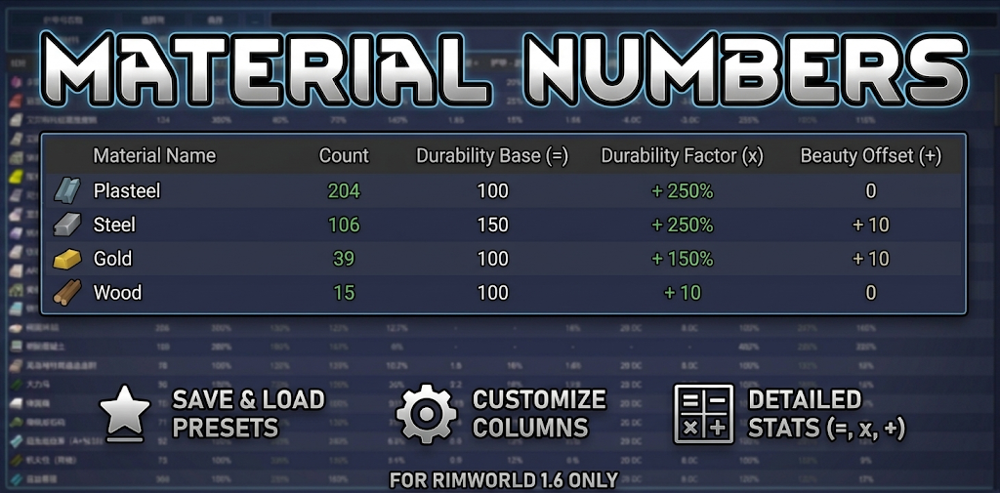

# Material Numbers

[English](README.md) | [简体中文](README.zh-CN.md)



Material Numbers is a RimWorld 1.6 material comparison mod inspired by the complementary ideas behind [Stuff List (Continued)](https://steamcommunity.com/sharedfiles/filedetails/?id=2798767227) and [Numbers](https://steamcommunity.com/sharedfiles/filedetails/?id=1414302321). It gathers loaded materials into one place like Stuff List, while offering Numbers-style column selection, sorting, layout customization, and saved presets. It is an independent implementation and does not require either mod.

## Design references

- [Stuff List (Continued)](https://steamcommunity.com/sharedfiles/filedetails/?id=2798767227) established the core use case of comparing many materials side by side in one table.
- [Numbers](https://steamcommunity.com/sharedfiles/filedetails/?id=1414302321) inspired the player-configurable columns, sorting, and reusable-view workflow.

Material Numbers applies those ideas specifically to material management and independently implements stat discovery, material grouping, value semantics, and global presets. These mods are references, not dependencies.

## Quick start

1. Open the **Materials** main tab.
2. Choose a built-in preset such as Construction, Armor and Apparel, or Gathering and Production.
3. Narrow the table by material group, item type, and inventory scope, for example All definitions + Food + On map.
4. Use **Columns** to choose properties. Click a header to sort; drag headers to reorder or resize them.
5. Save the result. Changes to a built-in preset are saved as a new global custom preset.

Column markers `=`, `×`, and `+` identify base values, material factors, and material offsets.

## Features

- Discovers every loaded `ThingDef` and provides dynamic item-type filtering.
- Builds columns from base stats, material factors, and offsets.
- Marks base, factor, and offset columns with `=`, `×`, and `+`, respectively, and formats every factor as a percentage.
- Safely discovers direct `IEnumerable<StatModifier>` and `IDictionary<StatDef, float>` containers on mod extensions.
- Recognizes `SurvivalToolsLite.StuffPropsTool.toolStatFactors` without a hard dependency and groups those columns as tool stats.
- Supports searchable columns, horizontal and vertical scrolling, sorting, column removal, drag reordering, and width adjustment.
- Filters by compact material groups, item types, current map availability, or valid storage. The default Common materials view excludes unclassified definitions; selecting an item type automatically switches to All definitions.
- Provides seven built-in layouts for overview, construction, armor/apparel, gathering/production, weapon crafting, comfort/rest, and trade/stock, plus global user presets.

Missing factor and offset values use their neutral values (`100%` and `0`) and are shown in gray. Other missing values remain blank (`-`). Column IDs from temporarily absent mods remain in saved presets and become visible again when their source mod returns.

## Build

```powershell
& "G:/Github/Game/Rimworld/_tooling/scripts/Build-RimWorldMod.ps1" `
  -Project "G:/Github/Game/Rimworld/Material-Numbers/Source/MaterialNumbers/MaterialNumbers.csproj" `
  -Configuration Release
```

The build writes `MaterialNumbers.dll` to `1.6/Assemblies`. The project does not require Harmony and does not read private game assemblies during the build.

## Extension API

Other mods can implement `IMaterialColumnProvider` and call `MaterialNumbersRegistry.Register(provider)`. Providers describe columns and value readers; Material Numbers owns discovery caching, layout state, and rendering.

## Scope

- RimWorld 1.6 only.
- Presets are global across saves.
- No preset import/export in the first release.
- No hard dependency on Stuff List, Numbers, Survival Tools Lite, HSK, or Harmony.

## TODO

- Add dedicated property providers for food, medicine, weapons, plants, and other definition types, including nutrition, medical effects, damage, and yield.
- Add type-specific column presets on top of the generic `ThingDef` property table.
