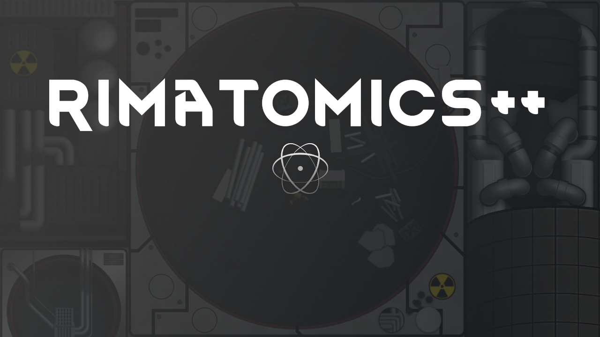

# Rimatomics++ 

A RimWorld mod that adds late game upgrades, buildings, and patches for Rimatomics.

Find it [here](https://steamcommunity.com/sharedfiles/filedetails/?id=3774907235) on the Steam workshop.

Done:
- Moved research to main tab and changed cost to 1000.
- Fixed guidance system research project UI.
- Partially fixed lag when targeting far away world tiles with nukes.
- Nukes can now properly travel to targets in space (option in settings to ignore signal jammers if needed).
- Fire missions can now properly travel to targets in space.
- Added a history event for nuking a settlement.
- Nuking another faction's settlement now properly destroys it in a manner that is consistent with base game, with configurable goodwill gains.
- Fixed console warning spam when a pawn is irradiated.
- PPHC
- Afterburners - 5x ICBM speed.
- Battery warning alert fix.
- Nuclear cell flash fix (bunch of warnings in console).
- Punisher now shows min range outline when placing, instead of arbitrary (26).
- Electromagnetically-Enhanced Projectile Accelerator (EEPA) - 5x fire mission speed, can target space.
- Advanced Barrel Orientation Systems (ABOS) - Fire mission own map + no longer requires LOS.
- UI Ordering Pass
- Fuel rod UI.
- Research bench inspect.
- Multiplayer compatibility.
- Hide signal jammer option when no Odyssey.

In Progress:
- Wording & Punctuation Pass

Known Issues:
- Quest "Defeat All Enemies" throws an error when giving items after completing via nuke (error also in base Rimatomics).

To Add:

- ADS stops manhunters?
- Marauder upgrade, halves cooldown and volley size.
- Coordinated Mission Overseer Module (CMOM) - Advanced fire mission controls.
